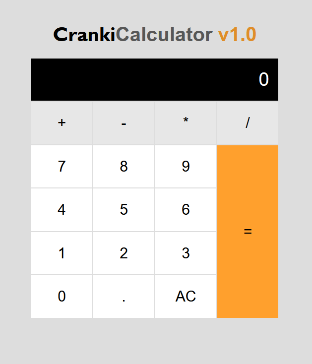

# JS Calculator 🚀

A simple and minimalistic calculator made using JavaScript

## Features ✨

- Ability to add, subtract, multiply and divide numbers 
- Decimal point functionality 
- Ability to clear all displaying data at once 

## Installation 🛠️

1. Clone the repository.
2. Navigate to the project directory.
3. Open the `index.html` file using any web browser of your choice.

## Screenshots 📷

## Technologies Used 🛠️

- HTML & CSS
- JavaScript  

## License 📝

This project is licensed under the [License Name](link-to-license-file).

## Contact 📧

For any questions or feedback, feel free to reach out to me at alexanderafoko@gmail.com